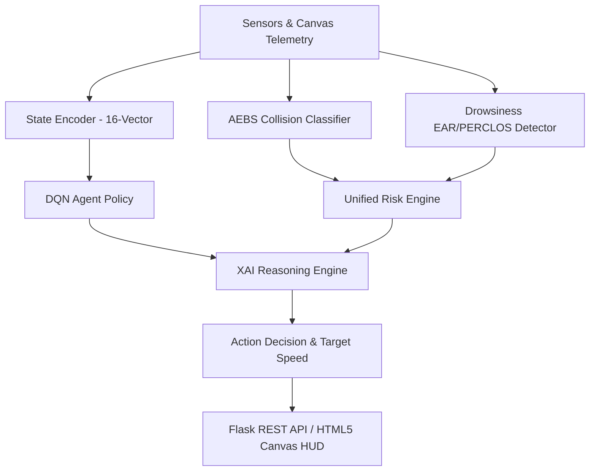

# NeuroDriver — System Architecture & Technical Specification

## 1. System Overview
NeuroDriver is an AI-powered autonomous driving simulation platform built specifically to address high-risk Indian traffic environments. It integrates:
- **5-Tier Advanced Emergency Braking System (AEBS)**
- **Deep Q-Network (DQN) Reinforcement Learning Agent**
- **Unified Multi-Contributor Risk Engine (0–100 Score)**
- **Eye Aspect Ratio (EAR) & PERCLOS Drowsiness State Machine**
- **Pinhole Distance Estimation & Threat Classifier**
- **Explainable AI (XAI) Reasoning Engine**

---

## 2. Component Pipeline

---

## 3. Deep Q-Network (DQN) Policy
- **State Vector Size**: 16 Normalized Inputs
  1. `ego_speed` / 120
  2. `ego_lane` / 4
  3. `weather_risk_weight`
  4. `front_vehicle_distance` / 200
  5. `front_vehicle_rel_speed` / 120
  6. `left_lane_clearance`
  7. `right_lane_clearance`
  8. `cattle_distance` / 200
  9. `pothole_distance` / 200
  10. `wrong_side_distance` / 200
  11. `driver_fatigue_level`
  12. `visibility_meters` / 300
  13. `road_friction_coefficient`
  14. `traffic_density_level` / 5
  15. `collision_risk_score` / 100
  16. `emergency_brake_flag`
- **Action Space**: 5 Discrete Actions (`CRUISE`, `ACCELERATE`, `BRAKE`, `TURN_LEFT`, `TURN_RIGHT`)
- **Network Topology**: $16 \rightarrow 128 \rightarrow 64 \rightarrow 5$ with ReLU activation layers.

---

## 4. AEBS Safety Tiers
1. **SAFE**: $\text{TTC} > 5.0\text{s}$
2. **CAUTION**: $3.0\text{s} < \text{TTC} \le 5.0\text{s}$
3. **WARNING**: $2.0\text{s} < \text{TTC} \le 3.0\text{s}$
4. **CRITICAL**: $1.0\text{s} < \text{TTC} \le 2.0\text{s}$
5. **EMERGENCY**: $\text{TTC} \le 1.0\text{s}$ or distance $< 0.5 \times d_{\text{stop}}$
